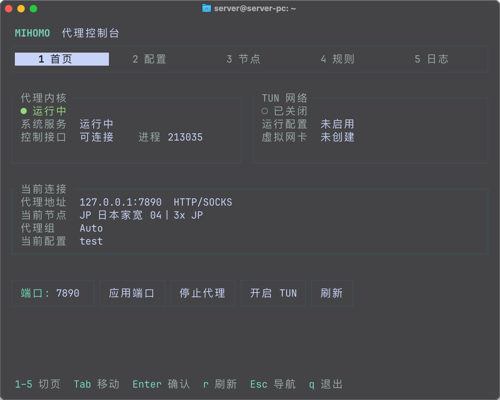

# mihomo-loongnix

面向 Loongnix / LoongArch ABI2 的 Mihomo 管理工具，通过终端界面或可选独立网页管理代理内核、订阅配置、节点、规则和日志。



## 项目来源

本项目基于 [WangZhongDian/mihomo-tui](https://github.com/WangZhongDian/mihomo-tui) 开发，在原项目基础上进行了 Loongnix 适配、管理服务与代理内核分离，以及终端界面的精简和调整。感谢原作者的工作。

- 本仓库：[MilkDrag0n/mihomo-loongnix](https://github.com/MilkDrag0n/mihomo-loongnix)
- 原始仓库：[WangZhongDian/mihomo-tui](https://github.com/WangZhongDian/mihomo-tui)
- 项目许可证：[MIT](LICENSE)

### Mihomo 内核来源

代理能力由 [MetaCubeX/mihomo](https://github.com/MetaCubeX/mihomo) 提供，也称 Clash.Meta。内核是独立项目，遵循其自身许可证；本仓库不包含内核二进制文件，也不维护内核源码。

请从 [Mihomo 官方发布页](https://github.com/MetaCubeX/mihomo/releases) 单独下载兼容内核。Loongnix / LoongArch ABI2 应选择对应的 `linux-loong64-abi2` 构建。已有部署使用 `v1.19.30`，这只是已有部署版本，并非要求使用的最新版本。

## 安装方式与环境要求

### 环境要求

| 项目 | 要求 |
| --- | --- |
| 操作系统 | 主要面向 Loongnix GNU/Linux 25、LoongArch ABI2；机器架构通常显示为 `loongarch64` |
| 服务管理 | systemd，用于分别管理后台服务和 Mihomo 内核 |
| 构建工具 | Git、Go `1.26.1` 或更新版本，以 [go.mod](go.mod) 为准 |
| 部署工具 | Python 3.8+、sudo、systemd；测试与日常部署分开 |
| 内核 | 已解压、具有执行权限的 ABI2 兼容 Mihomo 程序 |
| 终端 | 支持 UTF-8 和颜色的终端，可通过 SSH 使用 |
| 权限 | 安装服务需要 root；日常使用由普通用户通过授权组操作 |
| TUN | 启用时需要系统支持 TUN，并提供 `ip`、`nft` 等网络管理工具 |

下面用于**全新安装**。已有部署请先阅读 [部署、升级与回滚说明](docs/LOONGNIX.md)，不要直接覆盖正在使用的内核或运行数据。

### 1. 获取源码

在服务器本地磁盘上执行：

```bash
mkdir -p "$HOME/projects"
cd "$HOME/projects"
git clone https://github.com/MilkDrag0n/mihomo-loongnix.git
cd mihomo-loongnix
./scripts/install-git-hooks.sh
```

### 2. 准备 Mihomo 内核

从官方发布页下载 ABI2 兼容的压缩包，先解压。以下示例中的路径和文件名应替换为实际下载的文件：

```bash
gzip -dk /path/to/mihomo-linux-loong64-abi2-VERSION.gz
sudo install -d -m 0700 /var/lib/mihomo-tui/bin
sudo install -m 0700 /path/to/mihomo-linux-loong64-abi2-VERSION /var/lib/mihomo-tui/bin/mihomo
sudo /var/lib/mihomo-tui/bin/mihomo -v
```

最后一条命令应能正常显示内核版本。压缩包本身不能作为可执行程序使用。

默认查找的文件名是 **`mihomo`**。安装器也会查找系统路径中的 `mihomo`，例如 `/usr/local/bin/mihomo`，并将找到的绝对路径写进 `mihomo.service`。显式设置 `mihomo_binary_path` 时可以使用其他文件名；已安装服务的启动路径还需要同步更新。

### 3. 构建当前代码

~~~bash
./scripts/build-current.sh
~~~

普通用户构建当前工作区，包括未提交修改；不自动运行测试。程序输出到 ~/.local/share/mihomo-loongnix/build/current/mihomo-tui。

### 4. 安装后台服务

在源码目录中执行：

```bash
artifact_root="${XDG_DATA_HOME:-$HOME/.local/share}/mihomo-loongnix/build/current"
sudo "$artifact_root/mihomo-tui" install_service
```

安装器会安装 `/usr/local/bin/mihomo-tui`，创建并启动 `mihomo-manager.service`，同时创建独立的 `mihomo.service`。全新安装后，先导入并激活配置，再从首页启动内核。

通过普通用户执行 `sudo` 安装时，安装器会将该用户加入授权组。若需要为另一个用户授权：

```bash
sudo mihomo-tui grant_operator 用户名
```

完成后重新登录 SSH 或桌面会话，使组权限生效，再检查管理服务：

```bash
systemctl is-active mihomo-manager.service
mihomo-tui
```

当前推荐上述源码安装流程。仓库中保留的 `scripts/install.sh` 仍有原作者仓库地址及压缩包处理等遗留问题，暂不作为本项目的安装入口。

### 已有部署升级

用普通用户直接执行，不需要版本号或提前提交：

~~~bash
./scripts/deploy.sh
~~~

脚本构建当前 TUI／管理器代码；已安装 Web 时一起构建。全部构建成功后才申请 sudo 权限，替换固定目录中的程序并重启管理器，保留 Web 原来的开关状态。Web 服务文件未变化时不重载 systemd。

不停止或更新 Mihomo 内核，不覆盖订阅、运行数据、域名或认证配置。没有部署备份、快照和自动回滚；失败直接显示错误和日志。测试放在开发流程中，不在每次部署时执行。历史备份保留。

仅构建而不更新服务可运行 ./scripts/deploy.sh --build-only。首次安装另行处理，详见 [开发与部署说明](docs/LOONGNIX.md#正式部署)。

## 项目结构

```text
mihomo-loongnix/
├── AGENTS.md                 # 开发约定、环境边界和交付流程
├── README.md                 # 中文说明
├── LICENSE                   # 项目许可证
├── go.mod / go.sum           # Go 版本与依赖
├── main.go                   # 程序入口、命令参数
├── cmd/                      # 命令处理、systemd 安装与授权
├── mihomotui/                # 后台服务及代理管理逻辑
│   ├── ui/                   # 首页、配置、节点、规则、日志界面
│   ├── manager_*.go          # 管理接口、配置切换、状态与日志
│   ├── core_controller*.go   # systemd / 测试进程控制
│   ├── mihomo_*.go           # 内核接口、进程与配置处理
│   ├── ipc_*.go              # 本机通信及权限校验
│   └── *_test.go             # 功能与回归测试
├── web/                      # Vue 网页、五页界面、依赖锁与组件测试
├── internal/webgateway/      # 网页鉴权、接口映射、日志和摘要
├── internal/webconfig/       # 可选网页私有配置
├── deploy/web/               # 独立网页服务模板
├── scripts/                  # 构建、快速部署、敏感信息检查、Git 钩子安装
├── docs/                     # 部署说明、接口及测试文档
├── testdata/                 # 无真实凭据的测试样例
├── .githooks/                # 提交前检查
├── .github/workflows/        # 持续检查和发布流程
└── makefile                  # 便捷构建与检查命令
```

源码与运行数据分开保存：正式运行数据在 `/var/lib/mihomo-tui`，用户侧文件在 `~/.config/mihomo-tui`。内核、订阅内容、密钥、日志及备份均不提交到本仓库。

## 项目功能

| 页面 | 功能 |
| --- | --- |
| 首页 | 查看内核、控制接口与 TUN 状态；启停内核、修改混合代理端口、开关 TUN；可选 Web 启停 |
| 配置 | 通过链接导入配置，激活、更新、重命名和删除；应用失败时尝试回滚 |
| 节点 | 查看代理组和当前节点，筛选节点、手动选择节点、测试节点延迟 |
| 规则 | 分页、筛选并查看内核当前生效的规则 |
| 日志 | 查看实时日志，独立控制磁盘日志记录，查看日志大小与轮转情况 |

界面通过本机 Unix socket 调用后台管理服务，再由后台操作 Mihomo；普通用户无需以 root 身份运行界面。默认混合代理端口为 `7890`，控制接口使用本机 `9090`。首次安装的 TUN 和磁盘日志默认关闭。

当前界面采用单一活动配置与 `rule` 模式，不包含原版的订阅池、连接管理或资源管理页面。磁盘日志默认单文件上限为 10 MiB，保留 3 个历史分卷。

## 后端与前端

项目包含管理后端、TUI 和可选网页。网页采用 Vue 3 / TypeScript，通过独立 Go 网关与 TUI 共用同一个管理器；运行时不需要 Node。网页有概览、配置、节点、规则和日志五页，支持密码登录或由外部网关认证，以及深浅主题和手机布局。

Web 默认关闭，独立安装和测试；已安装后随当前代码一起快速更新。在 TUI 首页开启／关闭，或使用 `mihomo-tui web status|start|stop`。退出 TUI 不关闭 Web；关闭 Web 不影响代理，服务器重启后默认不开启。首次安装需要先准备 HTTPS 入口；已有 Cloudflare Zero Trust 访问保护时可选择 external 模式，不设置 Web 管理员密码，不能仅运行开关命令。

网页构建与安装流程见 [网页接入指南](docs/WEB_INTEGRATION.zh-CN.md)。Web 构建需要 Node >=22.12、pnpm 10.34.5；使用 ./scripts/test-web.sh 独立测试。首次 Web 安装和日常更新均使用 ./scripts/deploy.sh；首次安装加 --install-web --public-url https://实际域名，已有外部访问保护时加 --auth-mode external。

- [管理后端接口](docs/MANAGER_API.zh-CN.md)：供 TUI／网关使用的 /v1 与 Web 生命周期。
- [浏览器 API](docs/WEB_API.zh-CN.md)：登录、业务映射、CSRF、错误、日志、只读摘要。
- [网页来源清单](web/THIRD_PARTY_NOTICES.md)：Zashboard 设计参考与依赖来源。

Homepage 可通过卡片跳转和独立只读令牌取摘要；无需依赖 Homepage 或 HoloBot 的运行。

## 使用方式

1. 运行 `mihomo-tui`，进入“配置”页，填写名称和订阅链接后选择“导入”。
2. 在配置列表中选择要使用的配置，点击“激活”；第一份导入的配置会被设为活动配置。
3. 返回“首页”，点击“启动代理”，等待显示内核运行状态。
4. 在“节点”页选择代理组和节点，按需测试延迟。
5. 将应用的 HTTP / SOCKS 代理设置为 `127.0.0.1:7890`；若在首页修改了端口，则使用新端口。这里的地址指运行 Mihomo 的服务器本机，Mac 不会因此自动使用该代理。

需要系统级代理时，可在首页开启 TUN；普通 HTTP / SOCKS 代理使用不需要开启 TUN。退出 TUI 后，正式后台服务和已启动的代理内核继续运行。

常用排查命令：

```bash
mihomo-tui help
mihomo-tui version
systemctl status mihomo-manager.service mihomo.service
sudo journalctl -u mihomo-manager.service -n 50 --no-pager
sudo journalctl -u mihomo.service -n 50 --no-pager
```

无法连接管理服务时，先检查服务状态与用户组权限；内核未启动时，先检查内核路径、活动配置和日志。

## 快捷键

| 按键 | 操作 |
| --- | --- |
| `1`—`5` | 切换首页、配置、节点、规则、日志；输入框内按正常文字处理 |
| `Tab` / `Shift+Tab` | 在当前页面控件之间向前 / 向后移动焦点 |
| 方向键 / `j` / `k` | 移动列表或表格选中项；`j` / `k` 在输入框内按正常文字处理 |
| `Enter` | 执行当前按钮、选择节点或菜单项 |
| `Space` | 在节点表格中选择当前节点 |
| `PgUp` / `PgDn` | 在节点、规则页向前 / 向后翻页 |
| `Home` / `End` | 在节点、规则页跳到第一页 / 最后一页 |
| `/` | 聚焦当前页面的筛选框（若有，且当前不在输入框中） |
| `Esc` | 从输入框返回页面主控件，其他情况下返回顶部导航 |
| `r` | 刷新当前页面；输入框内按正常文字处理 |
| `q` | 退出界面；输入框内按正常文字处理 |

支持鼠标点击。弹窗内使用 `Tab` / `Shift+Tab` 切换按钮、`Enter` 确认、`Esc` 取消；全局快捷键不会穿透弹窗或已展开的下拉框。

界面沿用终端默认背景与正文颜色，使用顶部五页导航、状态分区和底部快捷键提示。建议终端至少为 80 列 × 24 行；焦点以边框、下划线或局部反色显示，不要求专用字体。

更多资料：[部署与回滚](docs/LOONGNIX.md) · [管理接口](docs/MANAGER_API.zh-CN.md) · [界面控件说明](docs/UI_CONTROL_TREE.zh-CN.md) · [测试参考](docs/TEST_REFERENCE.zh-CN.md)
