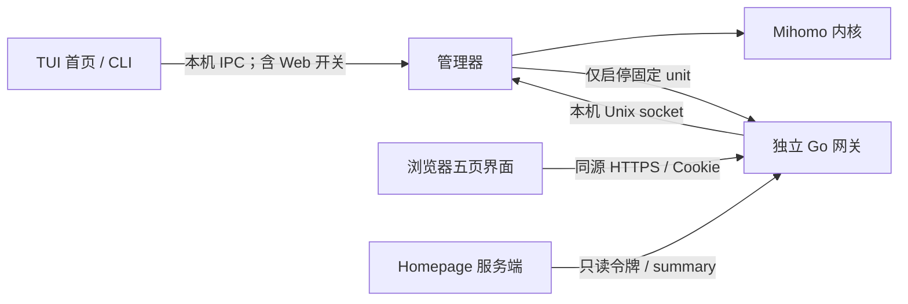

# 可选网页与服务器首页接入

网页源码和独立 Go 网关已实现；正式安装和 HTTPS 入口需要按下文配置。Web 默认关闭，TUI／管理器／代理不依赖网页进程，关闭网页不会停止代理。Homepage 只放跳转卡片和只读摘要；HoloBot 与本项目互不依赖。



业务逻辑仍在 manager：网页不读取正式订阅文件，不直接使用核心 secret，不连接 9090。网关普通账号属于 mihomo-tui 和 mihomo-tui-operator，因此可执行本机代理管理；HTTP 层支持密码认证或外部认证，并保留接口白名单。此账号自身是受信任操作员，不能把网页路由白名单当作被攻陷进程的系统权限隔离。

## 目录与构建环境

| 用途 | 路径 |
| --- | --- |
| 网页源码 | web/，Vue 3、TypeScript、Vite、Tailwind CSS、daisyUI |
| 独立网关 | cmd/mihomo-web/、internal/webgateway/ |
| 可选配置类型 | internal/webconfig/；无前端依赖 |
| Web 正式构建 | ~/.local/share/mihomo-loongnix/build/current/ |
| 日常检查 | ~/.local/share/mihomo-loongnix/checks/web/ |
| 测试私有状态 | ~/.local/state/mihomo-loongnix-test/web/ |
| Web 安装 | /opt/mihomo-web/runtime/，current 指向固定运行目录 |
| 私有配置 | /etc/mihomo-web/config.json，root:mihomo-web，0640 |
| 独立状态目录 | /var/lib/mihomo-web，mihomo-web，0700 |

构建需要 Go 1.26.1、Node >=22.12、pnpm 10.34.5、Python 3.8+。server-pc 已验证原生 Node 24.20.0（Node unofficial-builds 的 linux-loong64），工具链在用户的 ~/.local/share/mihomo-loongnix/toolchains/，不修改系统 Node。安装依赖用 frozen lockfile；esbuild 使用已下载的原生可选包，安装脚本明确禁用，构建已实际验证。

```bash
./scripts/test-web.sh
./scripts/build-web.sh
```

构建直接使用当前工作区，包括未提交修改。输出到固定目录，不再记录清单或按提交归档。测试单独执行，构建和部署不自动跑测试。未安装 Web 的日常部署不需要 Node。

## 完全隔离的预览与测试

```bash
. ./scripts/web-toolchain.sh
MIHOMO_WEB_DIST="$HOME/.local/share/mihomo-loongnix/checks/web/static" pnpm --dir web build
python3 scripts/preview-web.py
```

预览在 127.0.0.1:19080 使用假管理器和测试密码 `preview-only-mihomo`，终端会打印地址；Ctrl+C 只清理本次测试进程和状态。它不连接生产 socket，不操作 systemd，不包含真实订阅。远程电脑可用 SSH 转发同名本地端口，再访问本地地址：

```bash
ssh -N -L 19080:127.0.0.1:19080 server-pc
```

开发热更新另用 15173，Vite 将 API 转发至测试网关。生产 Cookie 的 HTTPS 场景由隔离 HTTPS 入口验收；HTTP 测试通过 test_mode 显式启用，且必须使用独立 socket。管理器影子模式或非 root 环境缺少 Web 控制替身时返回不可用，不会默认执行生产 systemctl。

## 正式安装（默认关闭）

先按 README 安装管理器／TUI。Web 首次安装与日常更新共用 ./scripts/deploy.sh，不再有独立的 Web 部署脚本。首次安装也会更新当前管理器代码。

准备实际 HTTPS 域名或私有 HTTPS 入口，将其转发到服务器 127.0.0.1:9080。转发保留公开 Host；日志路径禁用缓冲、允许 SSE 心跳，不使用整体短请求时限。第一版采用独立站点根路径，不支持挂在 /mihomo/ 等子路径。浏览器公开地址与 Homepage 内部 API 地址分开配置。

```bash
# 用普通用户执行，构建完成后才申请 sudo。
./scripts/deploy.sh --install-web --public-url https://mihomo.example.invalid
```

默认 password 模式交互设置管理员密码；external 模式不询问、不生成 Web 密码。两种模式都自动生成独立摘要令牌，只写服务器私有配置。安装后 Web 保持关闭、不设自启。已有 Web 服务或私有配置时拒绝重复初装；安装失败直接报告，不自动恢复。日常更新不加首次安装参数，现有免密码配置会保留。

在 TUI 首页选择“开启 Web”，或：

```bash
mihomo-tui web status
mihomo-tui web start
mihomo-tui web stop
```

这控制网页服务，不是打开电脑上的浏览器。退出 TUI 后 Web 可继续运行；服务器重启后默认不自启。未安装时首页提示“Web 未安装”，不会自动安装；Web 故障不阻止其他五页功能。

## 已有外部访问保护：不设置 Web 密码

已使用 Cloudflare Zero Trust / Access 保护该站点时，首次安装显式选择 external：

```bash
./scripts/deploy.sh --install-web \
  --public-url https://mihomo.example.invalid --auth-mode external
```

将示例域名替换为实际 HTTPS 地址。此模式不提示 Web 管理员密码，配置中的 password_hash 为空。通过外部网关后，网页直接进入控制台，不显示本地密码登录与退出按钮；Cloudflare 身份的退出由外部网关处理。现有 password 安装升级时仍保留原配置，不会自动变成 external；--auth-mode 只用于首次安装。

external 明确把访问者认证交给前置网关，本项目不再次校验 Access JWT，不从可伪造的身份请求头认定用户；所有能够到达本机源站的访问者均视为受信任操作员。Web 继续只监听回环地址，保留 HTTPS 公开 Host、同源 Origin、会话 Cookie、CSRF 和只读摘要令牌隔离。应用内会话用于请求校验与日志生命周期，不代表另一层用户登录。

管理器与 Web 必须都支持 auth_mode 配置；首次使用 external 前先用当前代码更新管理器。日常部署会从当前工作区一起构建已安装的 Web 与管理器。

## 复用 Cloudflare Tunnel

现有隧道由 Cloudflare 管理时，在隧道的公开应用路由中新增一条，保留其他应用的路由。主机网络模式下的 cloudflared 可连接本机 Web 监听地址：

| 路由字段 | 本项目设置 |
| --- | --- |
| 公开主机名 | 用户实际指定的专用域名，不带路径 |
| 源站服务 | HTTP，127.0.0.1:9080 |
| HTTP Host Header | 与 public_url 中的公开主机名一致；如有非默认公开端口，也带上端口 |
| 路径 | 留空，使用站点根路径 |
| 禁用分块编码 | 保持关闭，允许流式日志 |

public_url 仍为浏览器访问的 HTTPS 地址；本机源站使用 HTTP，不给 Web 额外配置自签名 HTTPS。网页默认关闭时，入口暂时不可用是预期行为。只发布正式安装后的 9080 服务，不把假数据预览端口 19080 配成公开路由。字段定义见 [Cloudflare 源站参数](https://developers.cloudflare.com/tunnel/advanced/origin-parameters/) 和 [公开应用路由](https://developers.cloudflare.com/tunnel/routing/)。

首次安装后依次验证：本机 Web 健康、公开地址登录、概览读取真实状态、日志保持一分钟、TUI 关闭／开启 Web；关闭网页期间单独确认代理仍正常。若入口已有 Cloudflare Access 策略，保留该策略，实际浏览器登录和 Homepage 服务端访问分别验收。

## 配置字段

JSON 拒绝未知字段；模板不含真实凭据。初始安装器生成全部必需字段，不直接照抄无效示例值：

| 字段 | 含义 |
| --- | --- |
| listen | 必须为明确回环 IP 和端口，默认 127.0.0.1:9080 |
| public_url | 正式 HTTPS 地址，无用户凭据、查询、片段和子路径 |
| manager_socket | 显式绝对路径，生产为 /run/mihomo-tui/daemon.sock |
| auth_mode | password 或 external；省略时兼容旧配置，使用 password |
| password_hash | password 模式需要 PBKDF2-SHA256 哈希；external 必须为空，不保存 Web 密码 |
| summary_token | 至少 32 字符的随机独立令牌 |
| show_node | 是否向摘要返回真实节点名，默认 false |
| test_mode | 仅测试允许回环 HTTP，不能使用生产 socket |

配置通过 `--config` 指定；第一版使用受控 JSON，替代方案阶段拟定的一组环境变量，不解析不必要的代理身份头，也不设置未使用的签名密钥。修改密码后重启 Web 以撤销旧会话；可以通过发布程序的 `--hash-password` 从标准输入生成哈希，避免在命令参数中放密码。更改配置时保留备份并校验 JSON、权限和公开入口。

## 日常快速更新

~~~bash
./scripts/deploy.sh
~~~

用普通用户执行，构建成功后才申请 sudo。不传提交号、不必提前提交或手动构建。脚本一起构建当前 TUI／管理器及已安装的 Web，并更新固定运行目录。

Web 原来运行则停止后更新，管理器重启完成后重新启动 Web；原来关闭则保持关闭。配置、域名、认证方式和服务自启设置保留。仅当 Web unit 文件内容变化时执行 daemon-reload。不停止或更新 Mihomo 内核。

没有部署备份、快照、自动回滚或外网代理检查。构建失败不更新服务；替换或启动失败直接输出错误与相关服务日志，修复后重新执行。启动成功只表示服务 active，公网与业务接口按需另行验证。Web 重启会使应用内会话失效。

第一次快速更新把 /opt/mihomo-web/current 指向固定 runtime，不删除旧 releases 或集中历史备份。新脚本不再通过旧部署记录确认当前源码，也不提供回退参数。首次安装仍使用上面的 Web 初装命令。

## Homepage 连接

- href：实际公开地址 + /overview，供浏览器点击。
- widget.url：Homepage 服务端可达的 /api/v1/summary；同机 host 网络可用 http://127.0.0.1:9080/api/v1/summary。
- Authorization：独立 Bearer 摘要令牌，在 Homepage 私有环境中保存，不放 URL、浏览器或 Git。
- widget 每 10 秒刷新；平铺 JSON 字段与 [Web API](WEB_API.zh-CN.md#homepage-摘要) 一致。没有跨项目数据库、源码或运行目录挂载。
- Web 关闭后摘要也关闭，卡片显示网页不可用，不表示代理停止。HoloBot／Homepage 停止不影响此网页。

当前已验证假数据下的登录、页面交互、节点切换／测速、日志、手机布局及 Go/Python 契约测试。首次生产安装、公开入口、真实服务账号与跨项目真实摘要需要安装后验收，不能从假数据预览推定成功。
