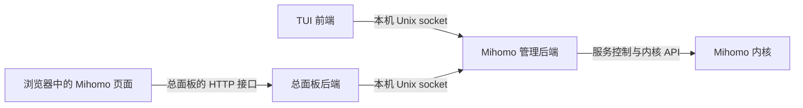

# 将 Mihomo 接入服务器总面板

## 现状与目标

当前项目已经包含独立的管理后端和 TUI 前端。后续网页前端可以与 TUI 共用管理后端，无需复制内核启停、配置处理、节点选择等业务逻辑。

本文是接入设计说明，**总面板、网页登录和网页页面尚未实现**。已实现的 HTTP 方法、请求和返回字段见 [管理接口文档](MANAGER_API.zh-CN.md)。



总面板后端与管理服务部署在同一台服务器时最直接。浏览器无法直接连接服务器的 Unix socket；若总面板后端在另一台机器上，需要另行设计经过认证的远程接入服务，当前项目没有提供这一能力。

## 职责划分

| 层 | 负责什么 |
| --- | --- |
| 网页前端 | 页面、表格、操作按钮、加载状态、错误提示和日志展示 |
| 总面板后端 | 网页登录、用户权限、请求校验、路由转接、错误筛选和日志流转换 |
| Mihomo 管理后端 | 配置持久化、内核启停、TUN/端口调整、节点选择、规则和日志读取 |
| Mihomo 内核 | 代理、路由规则执行及实际网络连接 |

总面板后端使用普通服务账号运行，按需获得 `mihomo-tui` 和 `mihomo-tui-operator` 组权限。仅加入只读组，只能读取概览状态与磁盘日志状态，不能读取配置列表、节点、规则或实时日志。是否授权、采用什么服务账号，在真正接入时再确定。

管理器看到的是总面板后端的本机身份，不知道浏览器中是谁。因此总面板必须在转发前检查登录用户权限，并为写操作记录用户身份与结果；不要把订阅 URL 或凭据写进审计日志。

## 网页接口映射建议

下面 `/api/mihomo/*` 路径是未来总面板的建议路径，不是当前管理器已提供的路由。

| 页面动作 | 建议总面板路由 | 调用现有管理接口 |
| --- | --- | --- |
| 概览状态 | `GET /api/mihomo/status` | `GET /v1/status` |
| 启停内核 | `POST /api/mihomo/core/start`、`stop` | 对应 `/v1/core/start`、`stop` |
| 修改 TUN 或端口 | `PUT /api/mihomo/tun`、`proxy-port` | 对应 `/v1/tun`、`proxy-port` |
| 配置管理 | `/api/mihomo/profiles` 及明确列出的子路由 | 对应配置列表、导入、激活、更新、重命名、删除 |
| 节点选择和测速 | `/api/mihomo/proxy-groups`、`proxy-delay` | 对应代理组和测速接口 |
| 生效规则 | `GET /api/mihomo/rules` | `GET /v1/rules` |
| 实时日志 | `GET /api/mihomo/logs/stream` | 读取并规范化 `/v1/logs/stream` |
| 磁盘记录 | `GET /api/mihomo/logging/status`、`PUT /api/mihomo/logging` | 对应磁盘日志接口 |

只转发明确允许的方法和路径，不提供一个能代理任意本机 URL、Unix socket 或旧管理接口的通用入口。Mihomo 的 `9090` 是内核控制接口，不是本项目管理接口；网页无需直接访问它或取得它的 secret。

## 先完成只读接入

推荐先做概览，再增加配置、节点与日志页面，最后接入写操作。可以先在总面板后端验证能连接 Unix socket。

以下 Python 标准库示例仅演示本机后端如何读取状态，不会启动 Web 服务，也不包含登录功能：

```python
import http.client
import json
import socket

class ManagerConnection(http.client.HTTPConnection):
    def __init__(self, socket_path, timeout=5):
        super().__init__("localhost", timeout=timeout)
        self.socket_path = socket_path

    def connect(self):
        self.sock = socket.socket(socket.AF_UNIX, socket.SOCK_STREAM)
        self.sock.settimeout(self.timeout)
        self.sock.connect(self.socket_path)

# 开发时替换为独立测试环境的 socket，避免连到正式后台。
conn = ManagerConnection("/run/mihomo-tui/daemon.sock")
try:
    conn.request("GET", "/v1/status")
    response = conn.getresponse()
    body = response.read()
    if response.status != 200:
        raise RuntimeError(f"管理接口返回 HTTP {response.status}")
    payload = json.loads(body)
    if not payload.get("success"):
        raise RuntimeError("管理接口查询失败")
    status = payload["data"]
    print({"running": status["core"]["running"], "proxy_port": status["proxy_port"]})
finally:
    conn.close()
```

网页后端将读取结果转换为页面需要的字段，而不是让浏览器直接读取服务器文件。容器化部署时还需要正确映射 socket 目录及对应组 ID；不需要把整个正式数据目录交给网页容器。

## 页面交互规则

- 页面中的“运行中”依据 `core.running`，不要仅看 HTTP 200 或 `service_active`。
- TUN 分别显示“配置开关”和“实际生效状态”。内核停止时保存开启配置，并不代表 TUN 已生效。
- 同一资源的写操作进行中时禁用重复提交，完成后重新读取状态或列表；不同 TUI/网页客户端可能同时操作，不要只信浏览器缓存。
- 可以先按约 3 秒刷新概览，隐藏页面时暂停；具体频率根据实际负载调整。节点、规则等列表可在进入页面或操作后刷新。
- 筛选、排序或截断名称只影响显示。选择节点时仍传原始完整名称，配置操作仍传后端 ID。
- 配置 URL 只在导入输入时收集；不要存入浏览器本地存储或普通请求日志。导入接口让后端发起下载，需要在总面板层限制谁可以使用它及允许的来源。
- 写请求给出独立超时策略；超时后显示“结果待确认”并回读状态，不自动重复破坏性操作。当前没有任务 ID 或操作进度接口。
- 不应承诺“一次调用失败就完全没改变状态”，当前部分回滚是尽力恢复。

## 日志流的接入

当前 `/v1/logs/stream` 虽使用 `text/event-stream` 响应头，正文却直接透传内核日志。总面板后端应：

1. 缓冲跨网络分块的数据，按行解析逐行 JSON，或解析上游 `data:` SSE 帧。
2. 将解析出的级别、正文等字段转换成总面板自己的标准 SSE 或 WebSocket 消息，不把原始响应头当作格式保证。
3. 限制日志行长度和页面缓存，按纯文本显示；断开浏览器连接时关闭对应的上游流。
4. 断流后做有间隔的重连。当前没有历史回放或事件 ID，重连可能遗漏日志，不能伪装成连续完整记录。

磁盘日志开关与实时显示独立。“清空网页显示”不应触发删除服务器日志，当前也没有公开的日志文件删除接口。

## 尚需实现的网页能力

现有后端足够支持第一版页面，但不是可直接暴露到公网的完整 Web 服务。总面板仍需实现登录、按用户授权、会话保护、请求大小限制、访问频率限制、HTTPS 接入以及经过筛选的错误提示。使用 Cookie 会话时还需保护写请求，避免跨站请求被误接受。

本次文档没有增加 TCP 监听、浏览器 CORS、网页账号、HTTP 网关或新的权限组，也没有修改正式服务。今后修改接口时，应同步维护接口文档、请求/返回字段和针对实际行为的回归验证。
